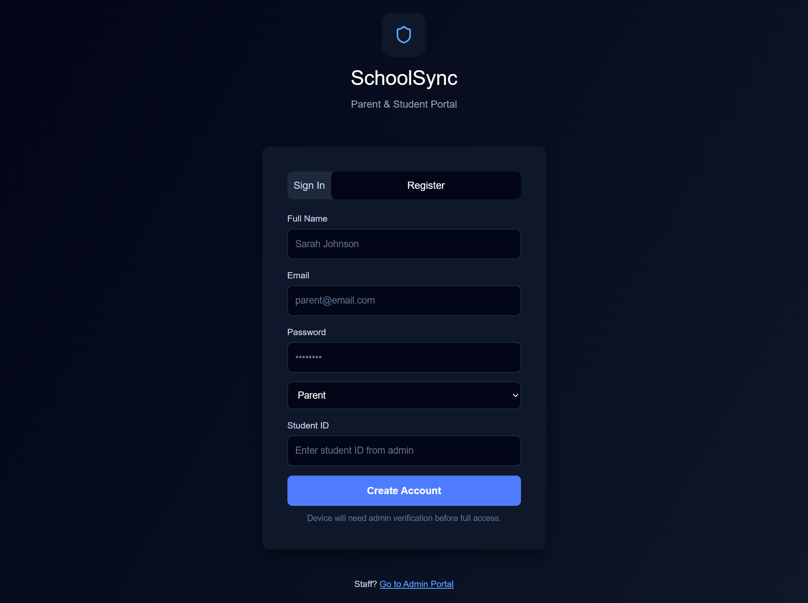
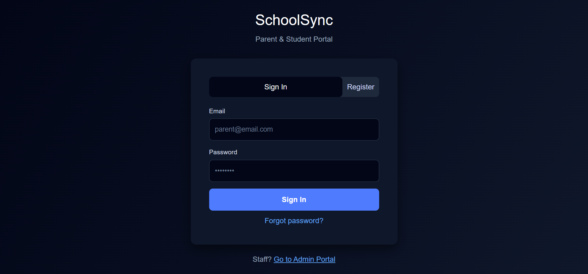
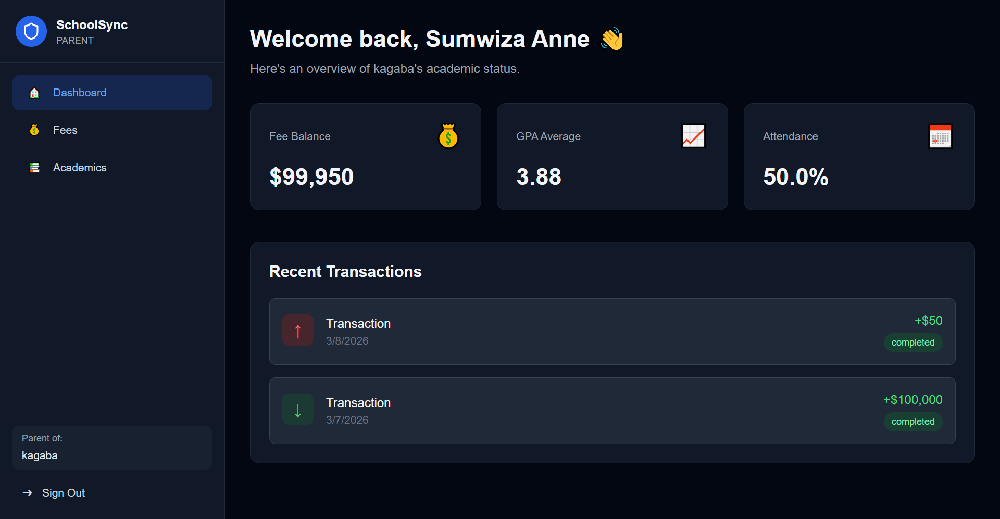
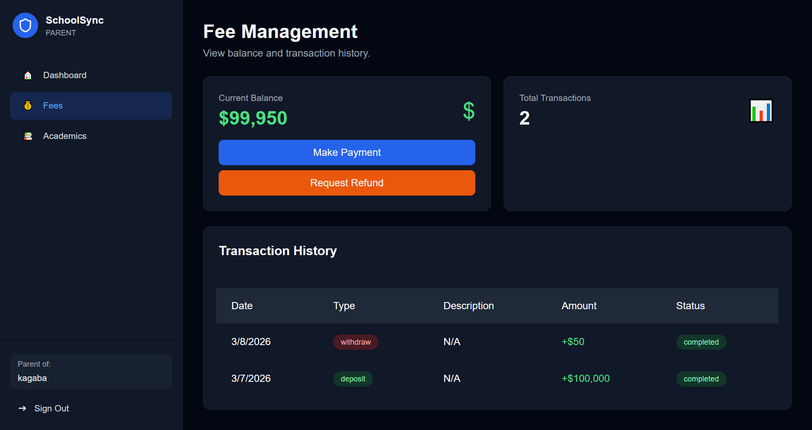
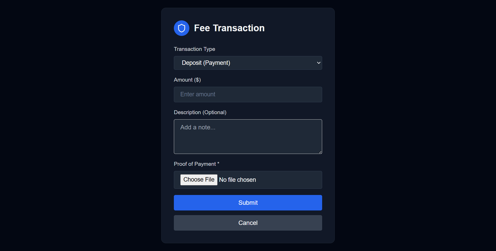
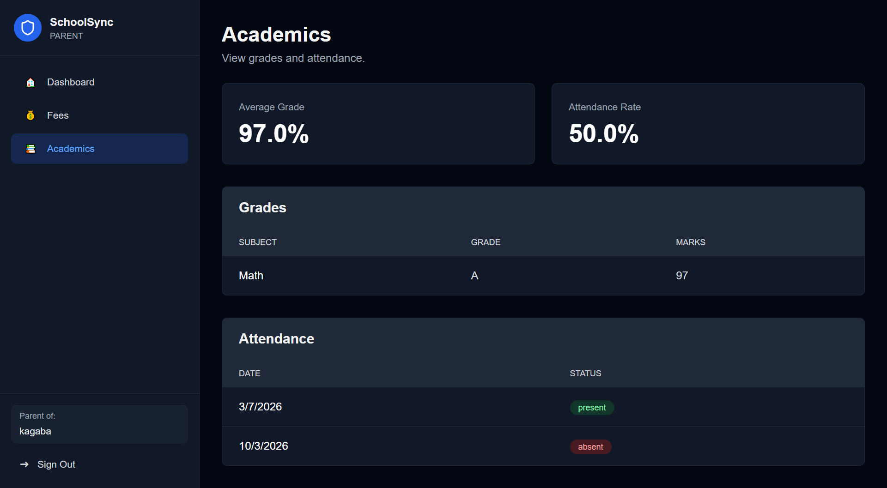

# School Management System - Client Application

## Overview
This is the client-facing application for parents and students to manage their school activities, including fee payments, viewing grades, attendance, and timetables.

## Features
- **Authentication**: Secure registration and login with SHA-512 password hashing
- **Device Verification**: Each device must be verified by admin before access
- **Fee Management**: Deposit fees and request refunds
- **Academic Records**: View grades, attendance, and class timetables
- **Dashboard**: Overview of fee balance, recent transactions, and academic performance
- **Low Balance Alerts**: Visual warnings when fee balance is low

## Tech Stack
### Backend
- Node.js & Express.js
- MongoDB with Mongoose
- JWT for authentication
- Helmet for security headers
- Express Rate Limit for API protection
- SHA-512 for password hashing

### Frontend
- React.js with Vite
- React Router for navigation
- Axios for API calls
- Responsive design

## Project Structure
```
client-app/
├── backend/
│   ├── src/
│   │   ├── config/         # Database configuration
│   │   ├── controllers/    # Request handlers
│   │   ├── dtos/          # Data transfer objects
│   │   ├── middlewares/   # Auth, validation, etc.
│   │   ├── models/        # MongoDB schemas
│   │   ├── routes/        # API routes
│   │   ├── services/      # Business logic
│   │   ├── utils/         # Helper functions
│   │   └── server.js      # Entry point
│   ├── package.json
│   └── .env.example
├── frontend/
│   ├── src/
│   │   ├── components/    # Reusable components
│   │   ├── pages/         # Page components
│   │   ├── services/      # API services
│   │   ├── styles/        # CSS files
│   │   ├── utils/         # Helper functions
│   │   ├── App.jsx        # Main app component
│   │   └── main.jsx       # Entry point
│   ├── package.json
│   └── vite.config.js
└── README.md
```

## Setup Instructions

### Prerequisites
- Node.js (v16 or higher)
- Postgresql
- npm or yarn

### Backend Setup
1. Navigate to backend directory:
   ```bash
   cd backend
   ```

2. Install dependencies:
   ```bash
   npm install
   ```

3. Create `.env` file from example:
   ```bash
   copy .env.example .env
   ```

4. Update `.env` with your configuration:
   ```
   PORT=5000
   MONGODB_URI=mongodb://localhost:27017/school_client
   JWT_SECRET=your_secure_jwt_secret_key
   NODE_ENV=development
   ```

5. Start MongoDB service

6. Run the backend:
   ```bash
   npm run dev
   ```

Backend will run on `http://localhost:5000`

### Frontend Setup
1. Navigate to frontend directory:
   ```bash
   cd frontend
   ```

2. Install dependencies:
   ```bash
   npm install
   ```

3. Start the development server:
   ```bash
   npm run dev
   ```

Frontend will run on `http://localhost:3000`

## API Endpoints

### Authentication
- `POST /api/auth/register` - Register new user
- `POST /api/auth/login` - Login user
- `POST /api/auth/logout` - Logout user

### Fee Management
- `POST /api/fee/deposit` - Make fee payment
- `POST /api/fee/withdraw` - Request refund
- `GET /api/fee/balance/:studentId` - Get fee balance
- `GET /api/fee/history/:studentId` - Get transaction history

### Student Records
- `GET /api/student/:studentId/profile` - Get student profile
- `GET /api/student/:studentId/grades` - Get grades
- `GET /api/student/:studentId/attendance` - Get attendance
- `GET /api/student/:studentId/timetable` - Get class timetable

## Security Features
- SHA-512 password hashing
- JWT token authentication
- Device ID verification
- Rate limiting (100 requests per 15 minutes)
- Helmet security headers
- Input validation and sanitization
- CORS protection

## Usage Flow

### Registration
1. User registers with name, email, password, and role (student/parent)
2. Device ID is automatically generated and stored
3. Account is created but not verified
4. User must wait for admin verification



### Login
1. User enters email, password
2. System checks device ID matches registered device
3. System verifies account is approved by admin
4. JWT token is issued for authenticated sessions




### Fee Payment
1. Navigate to Fee Payment page
2. Select transaction type (Deposit/Withdraw)
3. Enter amount and optional description
4. Submit transaction
5. Balance is updated immediately for deposits
6. Withdrawals are marked as pending for admin approval





### Viewing Academic Records
1. Dashboard shows overview of grades and attendance
2. Click on specific sections for detailed views
3. Timetable shows class schedule



## Development Notes
- All API calls require authentication except registration and login
- Device verification is mandatory for login
- Sessions are managed via JWT tokens
- Frontend uses localStorage for token persistence
- Low balance threshold is set at $1000


## Testing
To test the application:
1. Register a new account
2. Use admin panel to verify the device
3. Login with verified account
4. Test fee deposit/withdraw
5. View academic records

## Production Deployment
1. Set `NODE_ENV=production` in `.env`
2. Use strong JWT secret
3. Configure MongoDB with authentication
4. Build frontend: `npm run build`
5. Serve frontend build with a web server
6. Use process manager (PM2) for backend
7. Set up reverse proxy (nginx)
8. Enable HTTPS

## Troubleshooting
- **Cannot login**: Ensure device is verified by admin
- **API errors**: Check backend is running and MongoDB is connected
- **CORS errors**: Verify backend CORS configuration
- **Token expired**: Login again to get new token

